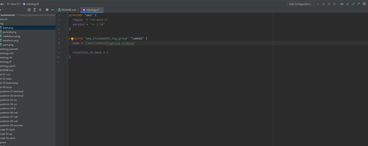
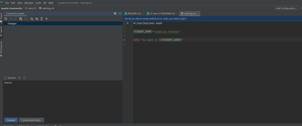
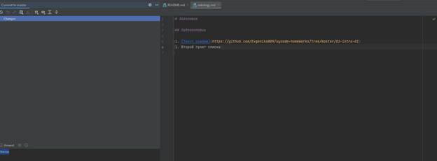
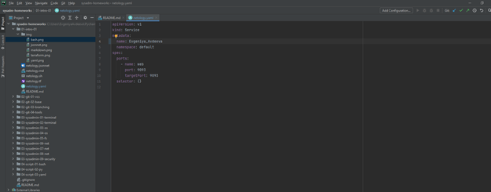
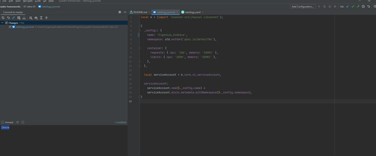

## Как сдавать задания

Обязательными к выполнению являются задачи без указания звездочки. Их выполнение необходимо для получения зачета и диплома о профессиональной переподготовке.

Задачи со звездочкой (*) являются дополнительными задачами и/или задачами повышенной сложности. Они не являются обязательными к выполнению, но помогут вам глубже понять тему.

Домашнее задание выполните в файле readme.md в github репозитории. В личном кабинете отправьте на проверку ссылку на .md-файл в вашем репозитории.

Также вы можете выполнить задание в [Google Docs](https://docs.google.com/document/u/0/?tgif=d) и отправить в личном кабинете на проверку ссылку на ваш документ.
Название файла Google Docs должно содержать номер лекции и фамилию студента. Пример названия: "1.1. Введение в DevOps — Сусанна Алиева".

Если необходимо прикрепить дополнительные ссылки, просто добавьте их в свой Google Docs.

Перед тем как выслать ссылку, убедитесь, что ее содержимое не является приватным (открыто на комментирование всем, у кого есть ссылка), иначе преподаватель не сможет проверить работу. Чтобы это проверить, откройте ссылку в браузере в режиме инкогнито.

[Как предоставить доступ к файлам и папкам на Google Диске](https://support.google.com/docs/answer/2494822?hl=ru&co=GENIE.Platform%3DDesktop)

[Как запустить chrome в режиме инкогнито ](https://support.google.com/chrome/answer/95464?co=GENIE.Platform%3DDesktop&hl=ru)

[Как запустить  Safari в режиме инкогнито ](https://support.apple.com/ru-ru/guide/safari/ibrw1069/mac)

Любые вопросы по решению задач задавайте в чате Slack.

---

# Домашнее задание к занятию «1.1. Введение в DevOps»

## Задание №1 - Подготовка рабочей среды

Вы пришли на новое место работы или приобрели новый компьютер.
Первым делом надо настроить окружение для дальнейшей работы. 

1. Установить PyCharm Community Edition: https://www.jetbrains.com/ru-ru/pycharm/download/ - это бесплатная версия IDE. 
Если у вас уже установлен любой другой продукт от JetBrains,то можно использовать его. 
1. Установить плагины:
    - Terraform,
    - MarkDown,
    - Yaml/Ansible Support,
    - Jsonnet.
1. Склонировать текущий репозиторий или просто создать файлы для проверки плагинов:
    - [netology.tf](netology.tf) – terraform,
    - [netology.sh](netology.sh) – bash,
    - [netology.md](netology.md) – markdown, 
    - [netology.yaml](netology.yaml) – yaml,
    - [netology.jsonnet](netology.jsonnet) – jsonnet.
1. Убедитесь, что работает подсветка синтаксиса, файлы должны выглядеть вот так:
    - Terraform: 
    - Bash: 
    - Markdown: 
    - Yaml: 
    - Jsonnet: 
1. Добавьте свое имя в каждый файл, сделайте снимок экрана и загрузите его на любой сервис обмена картинками.
1. Ссылки на картинки укажите в личном кабинете как решение домашнего задания. 

## Задание №2 - Описание жизненного цикла задачи (разработки нового функционала)

Чтобы лучше понимать предназначение дальнейших инструментов, с которыми нам предстоит работать, давайте 
составим схему жизненного цикла задачи в идеальном для вас случае.

### Описание истории

Представьте, что вы работаете в стартапе, который запустил интернет-магазин. Ваш интернет-магазин достаточно успешно развивался, и вот пришло время налаживать процессы: у вас стало больше конечных клиентов, менеджеров и разработчиков.Сейчас от клиентов вам приходят задачи, связанные с разработкой нового функционала. Задач много, и все они требуют выкладки на тестовые среды, одобрения тестировщика, проверки менеджером перед показом клиенту. В случае необходимости, вам будет необходим откат изменений. 

### Решение задачи

Вам необходимо описать процесс решения задачи в соответствии с жизненным циклом разработки программного обеспечения. Использование какого-либо конкретного метода разработки не обязательно. Для решения главное - прописать по пунктам шаги решения задачи (релизации в конечный результат) с участием менеджера, разработчика (или команды разработчиков), тестировщика (или команды тестировщиков) и себя как DevOps-инженера. 

 ### Ответ
 
 Жизненный цикл:

Создание бэклога продукта. Бэклог продукта (Product backlog) представляет собой упорядоченный по степени важности список требований, предъявляемых к разрабатываемому продукту. Элементы этого списка называются Пользовательскими историями (User story). Каждой истории соответствует уникальный ID.
Планирование спринта и создание Бэклога спринта. На этапе планирования определяется длительность спринта. Короткий спринт позволяет чаще выпускать работающие версии продукта, а следовательно чаще получать отзывы от клиента и вовремя выявлять возможные ошибки. С другой стороны, длинные спринты позволяют посвятить решению проблемы больше времени. Оптимальная длина спринта выбирается как нечто среднее между этими двумя решениями и составляет обычно около 2-ух недель. На этом этапе важно взаимодействие владельца продукта и скрам-команды. Владелец продукта определяет приоритет той или иной задачи, а задача скрам-команды состоит в определении необходимых трудозатрат. Во время планирования спринта команда выбирает самые приоритетные пользовательские истории из бэклога продукта и решает, каким образом будут решаться поставленные задачи. Истории, выбранные для реализации в течение данного спринта составляют Бэклог спринта (Sprint backlog). Количество историй, попадающих в бэклог спринта зависит от их длительности в story point’ах, присвоенных каждой истории на этапе предварительной оценки. Это количество выбирается так, чтобы каждая история была успешно реализована к концу спринта.
Работа над спринтом. На этапе планирования определяется длительность спринта. Короткий спринт позволяет чаще выпускать работающие версии продукта, а следовательно чаще получать отзывы от клиента и вовремя выявлять возможные ошибки. С другой стороны, длинные спринты позволяют посвятить решению проблемы больше времени. Оптимальная длина спринта выбирается как нечто среднее между этими двумя решениями и составляет обычно около 2-ух недель. На этом этапе важно взаимодействие владельца продукта и скрам-команды. Владелец продукта определяет приоритет той или иной задачи, а задача скрам-команды состоит в определении необходимых трудозатрат. Во время планирования спринта команда выбирает самые приоритетные пользовательские истории из бэклога продукта и решает, каким образом будут решаться поставленные задачи. Истории, выбранные для реализации в течение данного спринта составляют Бэклог спринта (Sprint backlog). Количество историй, попадающих в бэклог спринта зависит от их длительности в story point’ах, присвоенных каждой истории на этапе предварительной оценки. Это количество выбирается так, чтобы каждая история была успешно реализована к концу спринта.
Тестирование и демонстрация продукта. Поскольку в идеале результатом каждого спринта является продукт, готовый к работе, важное место в Scrum занимает процесс тестирования. Существуют разные способы свести к минимуму затраты на данном этапе: от уменьшения количества историй в спринте и, как результат, снижения количества ошибок до включения тестировщиков в скрам-команду. Финал каждого спринта — демонстрация готового продукта. Скрам-команда составляет ревью, в котором описывает цели спринта, поставленные задачи и то, как они были решены. Владелец продукта, заказчики и пользователи на основе ревью и демонстрации принимают решение о том, что должно быть изменено в дальнейшем процессе разработки.
Ретроспектива. Планирование следующего спринта. На основе отзыва о продукте, полученного после демонстрации, проводится ретроспектива. Ее основная цель — определить, как можно улучшить процесс разработки на следующем спринте, чтобы избежать возникших проблем и работать более эффективно. После того, как пути улучшения качества работы были определены, команда может приступать у планированию следующего спринта.

https://github.com/Evgenika809/sysadm-homeworks/tree/master/01-intro-01/img

