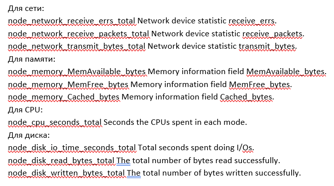

# Домашнее задание к занятию "3.4. Операционные системы, лекция 2"

1. На лекции мы познакомились с [node_exporter](https://github.com/prometheus/node_exporter/releases). В демонстрации его исполняемый файл запускался в background. Этого достаточно для демо, но не для настоящей production-системы, где процессы должны находиться под внешним управлением. Используя знания из лекции по systemd, создайте самостоятельно простой [unit-файл](https://www.freedesktop.org/software/systemd/man/systemd.service.html) для node_exporter:

    * поместите его в автозагрузку,
    * предусмотрите возможность добавления опций к запускаемому процессу через внешний файл (посмотрите, например, на `systemctl cat cron`),
    * удостоверьтесь, что с помощью systemctl процесс корректно стартует, завершается, а после перезагрузки автоматически поднимается.

2. Ознакомьтесь с опциями node_exporter и выводом `/metrics` по-умолчанию. Приведите несколько опций, которые вы бы выбрали для базового мониторинга хоста по CPU, памяти, диску и сети.

3. Установите в свою виртуальную машину [Netdata](https://github.com/netdata/netdata). Воспользуйтесь [готовыми пакетами](https://packagecloud.io/netdata/netdata/install) для установки (`sudo apt install -y netdata`). После успешной установки:
    * в конфигурационном файле `/etc/netdata/netdata.conf` в секции [web] замените значение с localhost на `bind to = 0.0.0.0`,
    * добавьте в Vagrantfile проброс порта Netdata на свой локальный компьютер и сделайте `vagrant reload`:
прием
    ```bash
    config.vm.network "forwarded_port", guest: 19999, host: 19999
    ```

    После успешной перезагрузки в браузере *на своем ПК* (не в виртуальной машине) вы должны суметь зайти на `localhost:19999`. Ознакомьтесь с метриками, которые по умолчанию собираются Netdata и с комментариями, которые даны к этим метрикам.

4. Можно ли по выводу `dmesg` понять, осознает ли ОС, что загружена не на настоящем оборудовании, а на системе виртуализации?
При запуске утилиты, в выводе имеется: "CPU MTRRs all blank - virtualized system."- ответ положительный
5. Как настроен sysctl `fs.nr_open` на системе по-умолчанию? Узнайте, что означает этот параметр. Какой другой существующий лимит не позволит достичь такого числа (`ulimit --help`)?

fs.nr_open = 1048576 обозначает максимальное количество дескрипторов файлов, которое может 
выделить процесс. Значение по умолчанию - 1024 * 1024 (1048576), чего должно хватить для большинства машин. Фактический лимит зависит от лимита ресурсов RLIMIT_NOFILE .
Количество файловых дескрипторов, открытых всеми процессами, не может превышать / proc / sys / fs / file-max
Количество файловых дескрипторов, открытых одним процессом, не может превышать мягкое ограничение nofile в пользовательском ограничении
Мягкий предел Nofile не может превышать его жесткий предел
жесткий предел nofile не может превышать / proc / sys / fs / nr_open

6. Запустите любой долгоживущий процесс (не `ls`, который отработает мгновенно, а, например, `sleep 1h`) в отдельном неймспейсе процессов; покажите, что ваш процесс работает под PID 1 через `nsenter`. Для простоты работайте в данном задании под root (`sudo -i`). Под обычным пользователем требуются дополнительные опции (`--map-root-user`) и т.д.

7. Найдите информацию о том, что такое `:(){ :|:& };:`. Запустите эту команду в своей виртуальной машине Vagrant с Ubuntu 20.04 (**это важно, поведение в других ОС не проверялось**). Некоторое время все будет "плохо", после чего (минуты) – ОС должна стабилизироваться. Вызов `dmesg` расскажет, какой механизм помог автоматической стабилизации. Как настроен этот механизм по-умолчанию, и как изменить число процессов, которое можно создать в сессии?

В простонародье fork-бомба называется) процессы постоянно копируют себя, потенциально вызывая отказ в обслуживании.
Эта функция выполняется рекурсивно. Он часто используется системным администратором для проверки ограничений пользовательского процесса на сервере. Ограничения процесса Linux могут быть настроены через /etc/security/limits.confи PAM, чтобы избежать бомбы bash fork (). После того, как в системе была активирована успешная вилочная бомба, может оказаться невозможным возобновить нормальную работу без перезагрузки системы, поскольку единственное решение проблемы вилочной бомбы - уничтожить все ее экземпляры.
 [ 7191.904407] cgroup: fork rejected by pids controller in /user.slice/user-1000.slice/session-9.scope
Чтобы защитить вашу систему Linux от форк-бомбы, нужно ограничить лимит процессов командой ниже. 
ulimit -S -u 5000
 ---

## Как сдавать задания

Обязательными к выполнению являются задачи без указания звездочки. Их выполнение необходимо для получения зачета и диплома о профессиональной переподготовке.

Задачи со звездочкой (*) являются дополнительными задачами и/или задачами повышенной сложности. Они не являются обязательными к выполнению, но помогут вам глубже понять тему.

Домашнее задание выполните в файле readme.md в github репозитории. В личном кабинете отправьте на проверку ссылку на .md-файл в вашем репозитории.

Также вы можете выполнить задание в [Google Docs](https://docs.google.com/document/u/0/?tgif=d) и отправить в личном кабинете на проверку ссылку на ваш документ.
Название файла Google Docs должно содержать номер лекции и фамилию студента. Пример названия: "1.1. Введение в DevOps — Сусанна Алиева".

Если необходимо прикрепить дополнительные ссылки, просто добавьте их в свой Google Docs.

Перед тем как выслать ссылку, убедитесь, что ее содержимое не является приватным (открыто на комментирование всем, у кого есть ссылка), иначе преподаватель не сможет проверить работу. Чтобы это проверить, откройте ссылку в браузере в режиме инкогнито.

[Как предоставить доступ к файлам и папкам на Google Диске](https://support.google.com/docs/answer/2494822?hl=ru&co=GENIE.Platform%3DDesktop)

[Как запустить chrome в режиме инкогнито ](https://support.google.com/chrome/answer/95464?co=GENIE.Platform%3DDesktop&hl=ru)

[Как запустить  Safari в режиме инкогнито ](https://support.apple.com/ru-ru/guide/safari/ibrw1069/mac)

Любые вопросы по решению задач задавайте в чате Slack.

---
