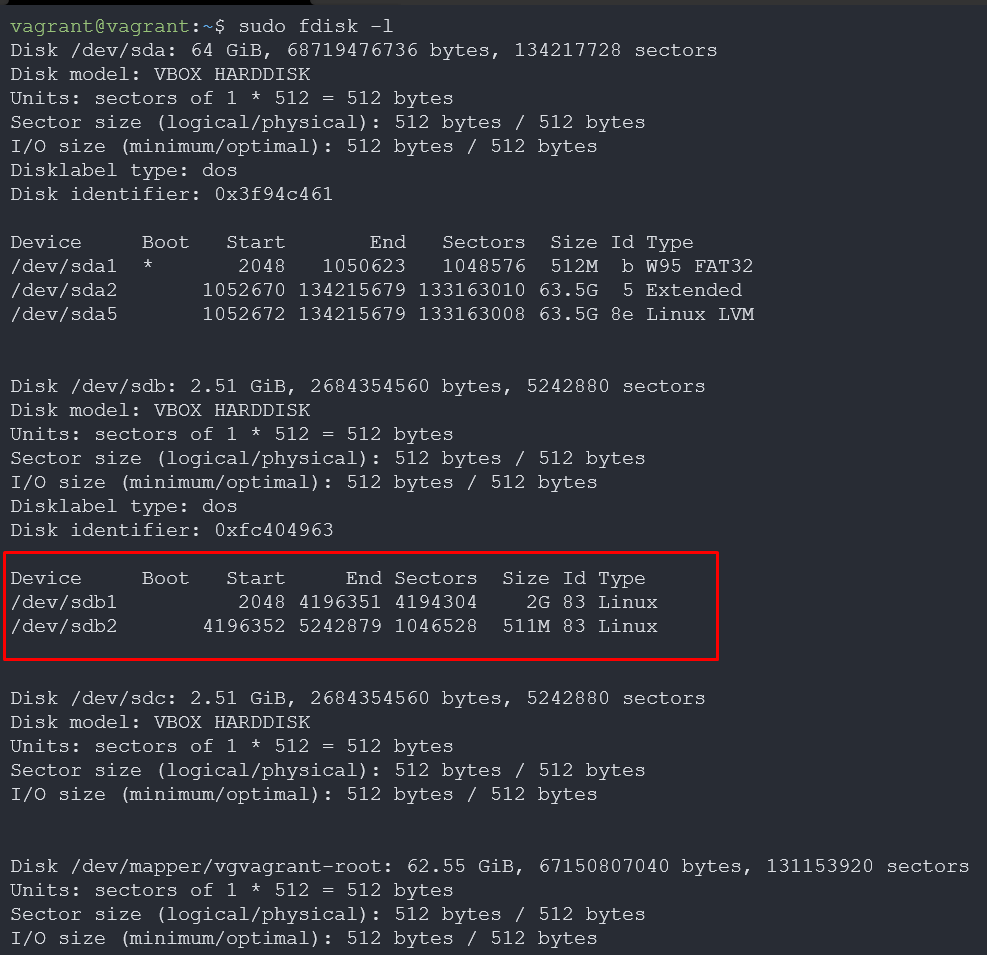
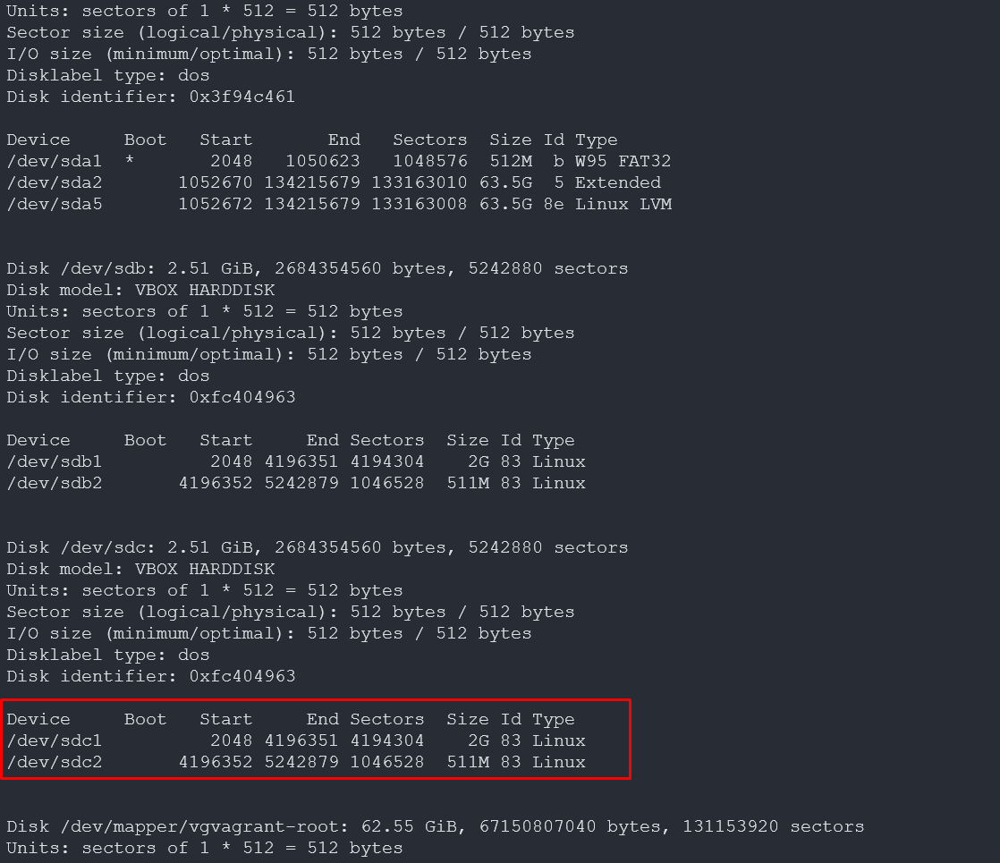
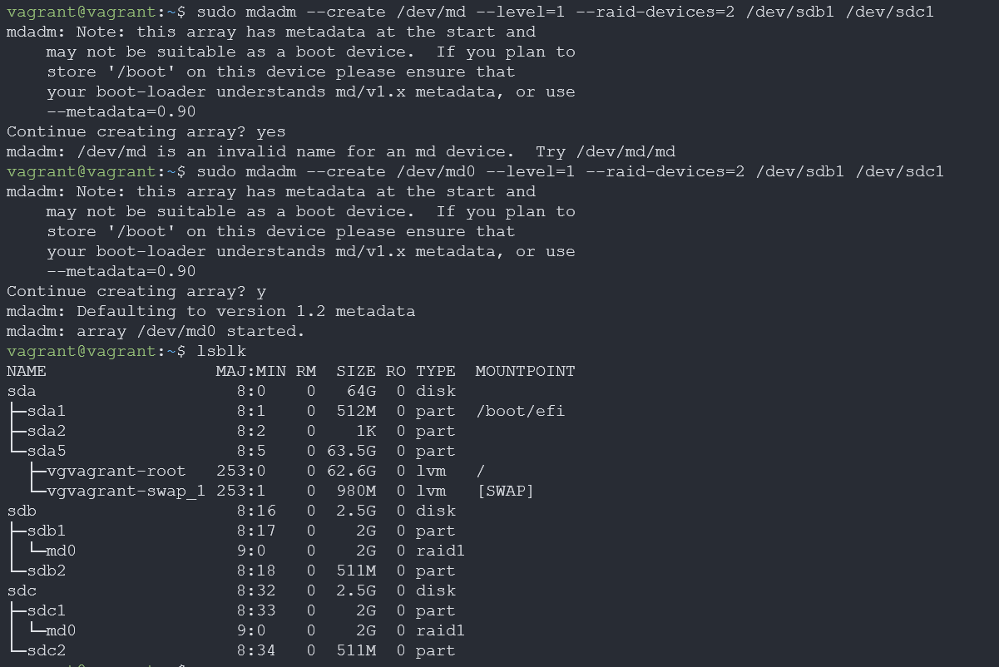
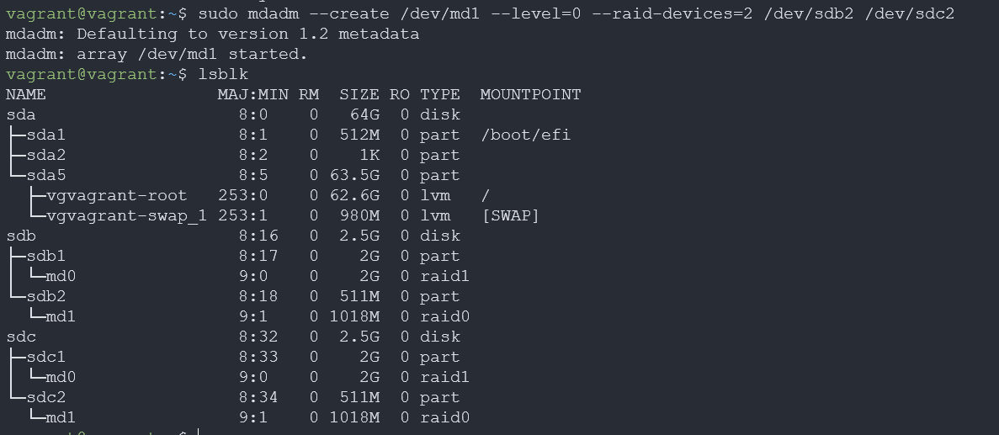
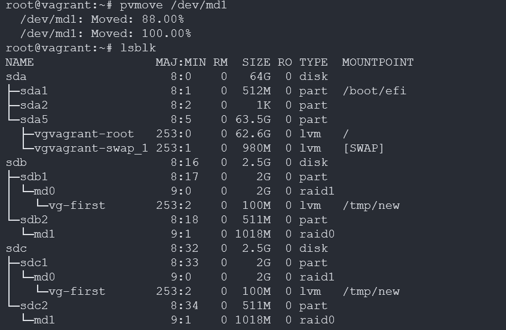

# Домашнее задание к занятию "3.5. Файловые системы"

1. Узнайте о [sparse](https://ru.wikipedia.org/wiki/%D0%A0%D0%B0%D0%B7%D1%80%D0%B5%D0%B6%D1%91%D0%BD%D0%BD%D1%8B%D0%B9_%D1%84%D0%B0%D0%B9%D0%BB) (разряженных) файлах.

Почитала

2. Могут ли файлы, являющиеся жесткой ссылкой на один объект, иметь разные права доступа и владельца? Почему?

Файлы, являющиеся жесткой ссылкой на один объект, не могут иметь разные права доступа и владельца. 
Жесткие ссыли имеют ту же информацию inode и набор разрешений что и у исходного файла.

3. Сделайте `vagrant destroy` на имеющийся инстанс Ubuntu. Замените содержимое Vagrantfile следующим:

    ```bash
    Vagrant.configure("2") do |config|
      config.vm.box = "bento/ubuntu-20.04"
      config.vm.provider :virtualbox do |vb|
        lvm_experiments_disk0_path = "/tmp/lvm_experiments_disk0.vmdk"
        lvm_experiments_disk1_path = "/tmp/lvm_experiments_disk1.vmdk"
        vb.customize ['createmedium', '--filename', lvm_experiments_disk0_path, '--size', 2560]
        vb.customize ['createmedium', '--filename', lvm_experiments_disk1_path, '--size', 2560]
        vb.customize ['storageattach', :id, '--storagectl', 'SATA Controller', '--port', 1, '--device', 0, '--type', 'hdd', '--medium', lvm_experiments_disk0_path]
        vb.customize ['storageattach', :id, '--storagectl', 'SATA Controller', '--port', 2, '--device', 0, '--type', 'hdd', '--medium', lvm_experiments_disk1_path]
      end
    end
    ```

    Данная конфигурация создаст новую виртуальную машину с двумя дополнительными неразмеченными дисками по 2.5 Гб.

4. Используя `fdisk`, разбейте первый диск на 2 раздела: 2 Гб, оставшееся пространство.

5. Используя `sfdisk`, перенесите данную таблицу разделов на второй диск.
sfdisk -d /dev/sdb | sfdisk -f /dev/sdc

6. Соберите `mdadm` RAID1 на паре разделов 2 Гб.

7. Соберите `mdadm` RAID0 на второй паре маленьких разделов.

8. Создайте 2 независимых PV на получившихся md-устройствах.

9. Создайте общую volume-group на этих двух PV.

10. Создайте LV размером 100 Мб, указав его расположение на PV с RAID0.

11. Создайте `mkfs.ext4` ФС на получившемся LV.

12. Смонтируйте этот раздел в любую директорию, например, `/tmp/new`.

13. Поместите туда тестовый файл, например `wget https://mirror.yandex.ru/ubuntu/ls-lR.gz -O /tmp/new/test.gz`.

14. Прикрепите вывод `lsblk`.

15. Протестируйте целостность файла:

     ```bash
     root@vagrant:~# gzip -t /tmp/new/test.gz
     root@vagrant:~# echo $?
     0
     ```

16. Используя pvmove, переместите содержимое PV с RAID0 на RAID1.

17. Сделайте `--fail` на устройство в вашем RAID1 md.

18. Подтвердите выводом `dmesg`, что RAID1 работает в деградированном состоянии.

19. Протестируйте целостность файла, несмотря на "сбойный" диск он должен продолжать быть доступен:

     ```bash
     root@vagrant:~# gzip -t /tmp/new/test.gz
     root@vagrant:~# echo $?
     0
     ```


20. Погасите тестовый хост, `vagrant destroy`.
 Грохну тачку, когда получу зачет =)

 
 ---

## Как сдавать задания

Обязательными к выполнению являются задачи без указания звездочки. Их выполнение необходимо для получения зачета и диплома о профессиональной переподготовке.

Задачи со звездочкой (*) являются дополнительными задачами и/или задачами повышенной сложности. Они не являются обязательными к выполнению, но помогут вам глубже понять тему.

Домашнее задание выполните в файле readme.md в github репозитории. В личном кабинете отправьте на проверку ссылку на .md-файл в вашем репозитории.

Также вы можете выполнить задание в [Google Docs](https://docs.google.com/document/u/0/?tgif=d) и отправить в личном кабинете на проверку ссылку на ваш документ.
Название файла Google Docs должно содержать номер лекции и фамилию студента. Пример названия: "1.1. Введение в DevOps — Сусанна Алиева".

Если необходимо прикрепить дополнительные ссылки, просто добавьте их в свой Google Docs.

Перед тем как выслать ссылку, убедитесь, что ее содержимое не является приватным (открыто на комментирование всем, у кого есть ссылка), иначе преподаватель не сможет проверить работу. Чтобы это проверить, откройте ссылку в браузере в режиме инкогнито.

[Как предоставить доступ к файлам и папкам на Google Диске](https://support.google.com/docs/answer/2494822?hl=ru&co=GENIE.Platform%3DDesktop)

[Как запустить chrome в режиме инкогнито ](https://support.google.com/chrome/answer/95464?co=GENIE.Platform%3DDesktop&hl=ru)

[Как запустить  Safari в режиме инкогнито ](https://support.apple.com/ru-ru/guide/safari/ibrw1069/mac)

Любые вопросы по решению задач задавайте в чате Slack.

---
