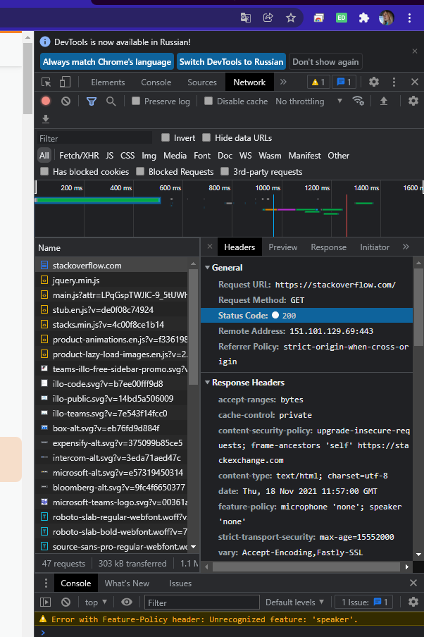
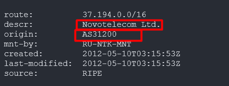
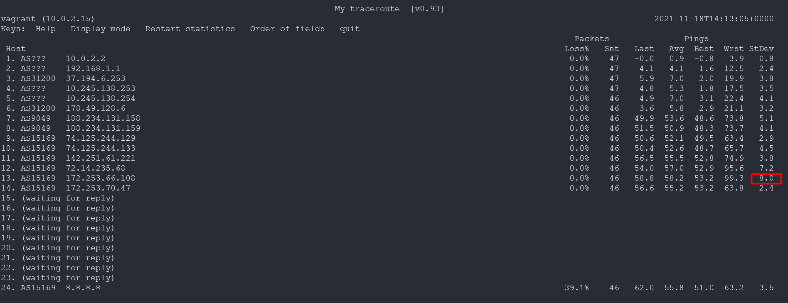
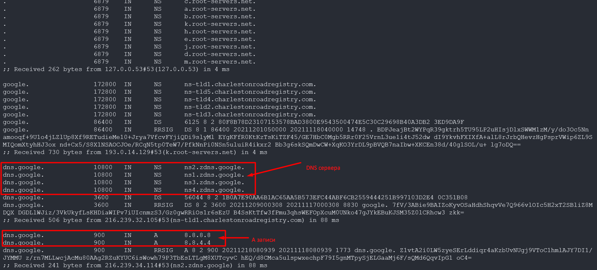

Домашнее задание к занятию "3.6. Компьютерные сети, лекция 1"
1. Работа c HTTP через телнет.
Подключитесь утилитой телнет к сайту stackoverflow.com telnet stackoverflow.com 80
отправьте HTTP запрос
GET /questions HTTP/1.0
HOST: stackoverflow.com
[press enter]
[press enter]
В ответе укажите полученный HTTP код, что он означает?
301 Moved Permanently - этот код ответа значит, что URI запрашиваемого ресурса был изменён.

2. Повторите задание 1 в браузере, используя консоль разработчика F12.
откройте вкладку Network
отправьте запрос http://stackoverflow.com
найдите первый ответ HTTP сервера, откройте вкладку Headers
укажите в ответе полученный HTTP код.

200 OK — успешный запрос.
проверьте время загрузки страницы, какой запрос обрабатывался дольше всего?

приложите скриншот консоли браузера в ответ.
3. Какой IP адрес у вас в интернете?

4. Какому провайдеру принадлежит ваш IP адрес? Какой автономной системе AS? Воспользуйтесь утилитой whois

5. Через какие сети проходит пакет, отправленный с вашего компьютера на адрес 8.8.8.8? Через какие AS? Воспользуйтесь утилитой traceroute

6. Повторите задание 5 в утилите mtr. На каком участке наибольшая задержка - delay?

7. Какие DNS сервера отвечают за доменное имя dns.google? Какие A записи? воспользуйтесь утилитой dig

8. Проверьте PTR записи для IP адресов из задания 7. Какое доменное имя привязано к IP? воспользуйтесь утилитой dig

В качестве ответов на вопросы можно приложите лог выполнения команд в консоли или скриншот полученных результатов.
