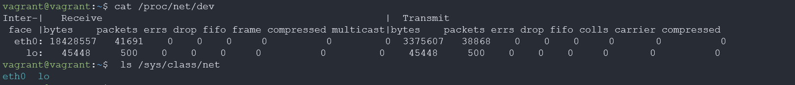
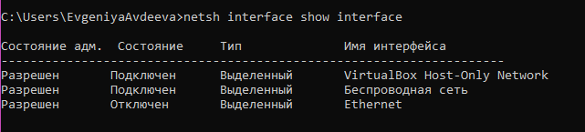
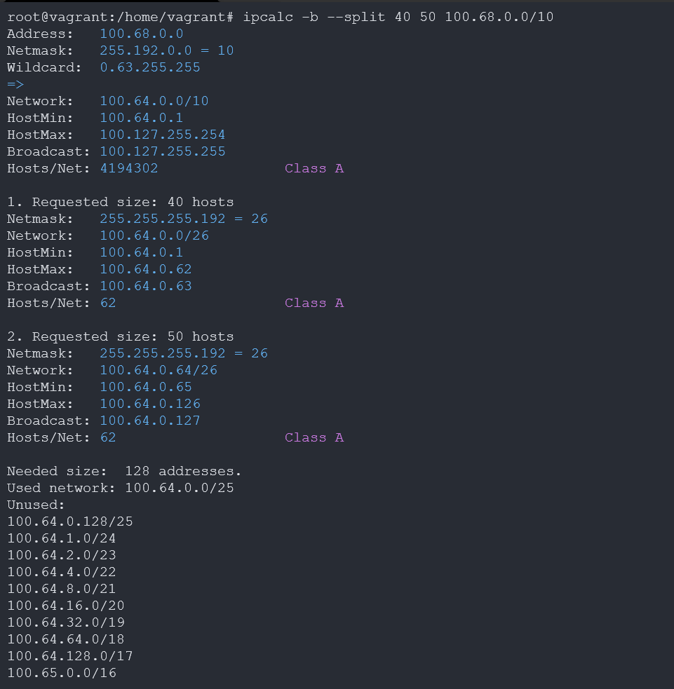

# Домашнее задание к занятию "3.7. Компьютерные сети, лекция 2"
____
### 1. Проверьте список доступных сетевых интерфейсов на вашем компьютере. Какие команды есть для этого в Linux и в Windows?



### 2. Какой протокол используется для распознавания соседа по сетевому интерфейсу? Какой пакет и команды есть в Linux для этого?
NDP (протокол обнаружения соседей, протокол обнаружения соседей) - ключевой протокол IPv6
ss — утилита для вывода статистической информации о сокетах.
'ndppd' или NDP Proxy Daemon - это демон, который проксирует NDP (сосед Протокол обнаружения) сообщения между интерфейсами.


### 3. Какая технология используется для разделения L2 коммутатора на несколько виртуальных сетей?  
VLAN позволяет нескольким сетям работать практически как одна локальная сеть. 
### Какой пакет и команды есть в Linux для этого?
В линукс используем пакет vlan, утилита vconfig.
### Приведите пример конфига.
```
auto vlan5
iface vlan5 inet static
address 192.168.5.1
netmask 255.255.255.0
vlan_raw_device eth0
```
### 4. Какие типы агрегации интерфейсов есть в Linux? 

* mode=0 (balance-rr)
> Этот режим используется по-умолчанию, если в настройках не указано другое. balance-rr обеспечивает балансировку нагрузки и отказоустойчивость. В данном режиме пакеты отправляются "по кругу" от первого интерфейса к последнему и сначала. Если выходит из строя один из интерфейсов, пакеты отправляются на остальные оставшиеся.При подключении портов к разным коммутаторам, требует их настройки.
* mode=1 (active-backup)
> При active-backup один интерфейс работает в активном режиме, остальные в ожидающем. Если активный падает, управление передается одному из ожидающих. Не требует поддержки данной функциональности от коммутатора.
* mode=2 (balance-xor)
> Передача пакетов распределяется между объединенными интерфейсами по формуле ((MAC-адрес источника) XOR (MAC-адрес получателя)) % число интерфейсов. Один и тот же интерфейс работает с определённым получателем. Режим даёт балансировку нагрузки и отказоустойчивость.
* mode=3 (broadcast)
> Происходит передача во все объединенные интерфейсы, обеспечивая отказоустойчивость.
* mode=4 (802.3ad)
> Это динамическое объединение портов. В данном режиме можно получить значительное увеличение пропускной способности как входящего так и исходящего трафика, используя все объединенные интерфейсы. Требует поддержки режима от коммутатора, а так же (иногда) дополнительную настройку коммутатора.
* mode=5 (balance-tlb)
> Адаптивная балансировка нагрузки. При balance-tlb входящий трафик получается только активным интерфейсом, исходящий - распределяется в зависимости от текущей загрузки каждого интерфейса. Обеспечивается отказоустойчивость и распределение нагрузки исходящего трафика. Не требует специальной поддержки коммутатора.
* mode=6 (balance-alb)
> Адаптивная балансировка нагрузки (более совершенная). Обеспечивает балансировку нагрузки как исходящего (TLB, transmit load balancing), так и входящего трафика (для IPv4 через ARP). Не требует специальной поддержки коммутатором, но требует возможности изменять MAC-адрес устройства.
### Какие опции есть для балансировки нагрузки? 
- DNS-балансировка. 
> На одно доменное имя выделяется несколько IP-адресов. Сервер, на который будет направлен клиентский запрос, обычно определяется с помощью алгоритма Round Robin.
- Построение NLB-кластера. 
> При использовании этого способа серверы объединяются в кластер, состоящий из входных и вычислительных узлов. Распределение нагрузки осуществляется при помощи специального алгоритма.
- Балансировка по IP
> с использованием дополнительного маршрутизатора
- Балансировка по территориальному признаку 
> осуществляется путём размещения одинаковых сервисов с одинаковыми адресами в территориально различных регионах Интернета.
### Приведите пример конфига.
пример полного конфига виртуального хоста для балансировки нагрузки на примере nginx:
```
log_format upstream '$remote_addr - $host [$time_local] "$request" '
    'request_length=$request_length '
    'status=$status bytes_sent=$bytes_sent '
    'body_bytes_sent=$body_bytes_sent '
    'referer=$http_referer '
    'user_agent="$http_user_agent" '
    'upstream_status=$upstream_status '
    'request_time=$request_time '
    'upstream_response_time=$upstream_response_time '
    'upstream_connect_time=$upstream_connect_time '
    'upstream_header_time=$upstream_header_time';
```

### 5. Сколько IP адресов в сети с маской /29 ? 
8 IP-адресов из них 2 служебных.
### Сколько /29 подсетей можно получить из сети с маской /24. 
32 /29 подсети
### Приведите несколько примеров /29 подсетей внутри сети 10.10.10.0/24. 
10.10.10.0 -10.10.10.8, 10.10.10.9-10.10.10.17

### 6.Задача: вас попросили организовать стык между 2-мя организациями. Диапазоны 10.0.0.0/8, 172.16.0.0/12, 192.168.0.0/16 уже заняты. Из какой подсети допустимо взять частные IP адреса? Маску выберите из расчета максимум 40-50 хостов внутри подсети.
100.64.0.0 — 100.127.255.255 (маска подсети: 255.192.0.0 или /10) Carrier-Grade NAT.



### 7. Как проверить ARP таблицу в Linux, Windows? 
for Windows: arp -a
for linux: ip neigh
### Как очистить ARP кеш полностью?
for Windows: arp -d -a
for linux: sudo ip -s -s neigh flush all
### Как из ARP таблицы удалить только один нужный IP?
for Windows: arp -d IP-address
for linux: ip neigh delete 192.168.4.5 dev eth0
_______
Задание для самостоятельной отработки (необязательно к выполнению)
### 8*. Установите эмулятор EVE-ng.

Инструкция по установке - https://github.com/svmyasnikov/eve-ng

Выполните задания на lldp, vlan, bonding в эмуляторе EVE-ng.
