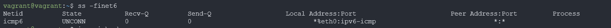

Домашнее задание к занятию "3.7. Компьютерные сети, лекция 2"

1. Проверьте список доступных сетевых интерфейсов на вашем компьютере. Какие команды есть для этого в Linux и в Windows?

2. Какой протокол используется для распознавания соседа по сетевому интерфейсу? Какой пакет и команды есть в Linux для этого?
NDP (протокол обнаружения соседей, протокол обнаружения соседей) - ключевой протокол IPv6
ss — утилита для вывода статистической информации о сокетах.
'ndppd' или NDP Proxy Daemon - это демон, который проксирует NDP (сосед Протокол обнаружения) сообщения между интерфейсами.

3. Какая технология используется для разделения L2 коммутатора на несколько виртуальных сетей? Какой пакет и команды есть в Linux для этого? Приведите пример конфига.
VLAN позволяет нескольким сетям работать практически как одна локальная сеть. 
В линукс используем пакет vlan, утилита vconfig.
auto vlan5
iface vlan5 inet static
address 192.168.5.1
netmask 255.255.255.0
vlan_raw_device eth0
4. Какие типы агрегации интерфейсов есть в Linux? Какие опции есть для балансировки нагрузки? Приведите пример конфига.
Типы агрегации (объединения) интерфейсов в Linux
mode=0 (balance-rr)
Этот режим используется по-умолчанию, если в настройках не указано другое. balance-rr обеспечивает балансировку нагрузки и отказоустойчивость. В данном режиме пакеты отправляются "по кругу" от первого интерфейса к последнему и сначала. Если выходит из строя один из интерфейсов, пакеты отправляются на остальные оставшиеся.При подключении портов к разным коммутаторам, требует их настройки.
mode=1 (active-backup)
При active-backup один интерфейс работает в активном режиме, остальные в ожидающем. Если активный падает, управление передается одному из ожидающих. Не требует поддержки данной функциональности от коммутатора.
mode=2 (balance-xor)
Передача пакетов распределяется между объединенными интерфейсами по формуле ((MAC-адрес источника) XOR (MAC-адрес получателя)) % число интерфейсов. Один и тот же интерфейс работает с определённым получателем. Режим даёт балансировку нагрузки и отказоустойчивость.
mode=3 (broadcast)
Происходит передача во все объединенные интерфейсы, обеспечивая отказоустойчивость.
mode=4 (802.3ad)
Это динамическое объединение портов. В данном режиме можно получить значительное увеличение пропускной способности как входящего так и исходящего трафика, используя все объединенные интерфейсы. Требует поддержки режима от коммутатора, а так же (иногда) дополнительную настройку коммутатора.
mode=5 (balance-tlb)
Адаптивная балансировка нагрузки. При balance-tlb входящий трафик получается только активным интерфейсом, исходящий - распределяется в зависимости от текущей загрузки каждого интерфейса. Обеспечивается отказоустойчивость и распределение нагрузки исходящего трафика. Не требует специальной поддержки коммутатора.
mode=6 (balance-alb)
Адаптивная балансировка нагрузки (более совершенная). Обеспечивает балансировку нагрузки как исходящего (TLB, transmit load balancing), так и входящего трафика (для IPv4 через ARP). Не требует специальной поддержки коммутатором, но требует возможности изменять MAC-адрес устройства.

5. Сколько IP адресов в сети с маской /29 ? Сколько /29 подсетей можно получить из сети с маской /24. Приведите несколько примеров /29 подсетей внутри сети 10.10.10.0/24.

6. Задача: вас попросили организовать стык между 2-мя организациями. Диапазоны 10.0.0.0/8, 172.16.0.0/12, 192.168.0.0/16 уже заняты. Из какой подсети допустимо взять частные IP адреса? Маску выберите из расчета максимум 40-50 хостов внутри подсети.

7. Как проверить ARP таблицу в Linux, Windows? Как очистить ARP кеш полностью? Как из ARP таблицы удалить только один нужный IP?

Задание для самостоятельной отработки (необязательно к выполнению)
8*. Установите эмулятор EVE-ng.

Инструкция по установке - https://github.com/svmyasnikov/eve-ng

Выполните задания на lldp, vlan, bonding в эмуляторе EVE-ng.
