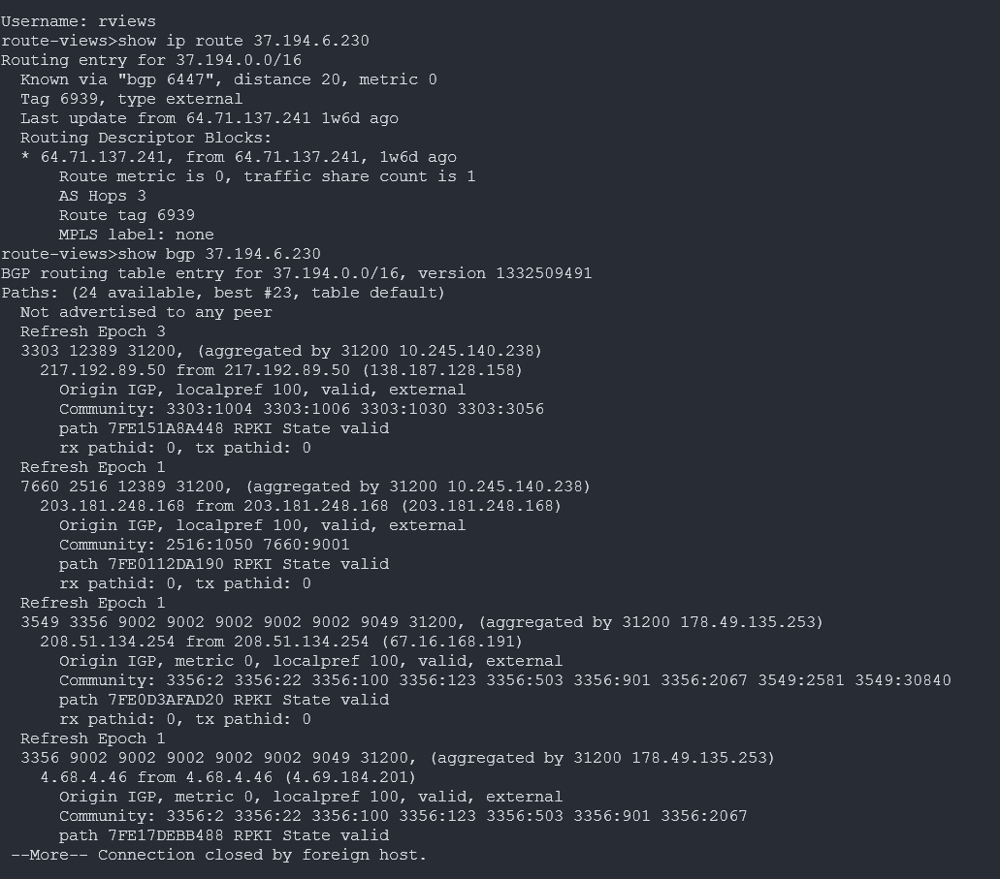

# Домашнее задание к занятию "3.8. Компьютерные сети, лекция 3"
### 1. Подключитесь к публичному маршрутизатору в интернет. Найдите маршрут к вашему публичному IP
```
telnet route-views.routeviews.org
Username: rviews
show ip route x.x.x.x/32
show bgp x.x.x.x/32
```

### 2. Создайте dummy0 интерфейс в Ubuntu. Добавьте несколько статических маршрутов. Проверьте таблицу маршрутизации.

### 3. Проверьте открытые TCP порты в Ubuntu, какие протоколы и приложения используют эти порты? Приведите несколько примеров.
 

### 4. Проверьте используемые UDP сокеты в Ubuntu, какие протоколы и приложения используют эти порты?

### 5. Используя diagrams.net, создайте L3 диаграмму вашей домашней сети или любой другой сети, с которой вы работали.

## Задание для самостоятельной отработки (необязательно к выполнению)
6*. Установите Nginx, настройте в режиме балансировщика TCP или UDP.

7*. Установите bird2, настройте динамический протокол маршрутизации RIP.

8*. Установите Netbox, создайте несколько IP префиксов, используя curl проверьте работу API.


## Как сдавать задания

Обязательными к выполнению являются задачи без указания звездочки. Их выполнение необходимо для получения зачета и диплома о профессиональной переподготовке.

Задачи со звездочкой (*) являются дополнительными задачами и/или задачами повышенной сложности. Они не являются обязательными к выполнению, но помогут вам глубже понять тему.

Домашнее задание выполните в файле readme.md в github репозитории. В личном кабинете отправьте на проверку ссылку на .md-файл в вашем репозитории.

Также вы можете выполнить задание в [Google Docs](https://docs.google.com/document/u/0/?tgif=d) и отправить в личном кабинете на проверку ссылку на ваш документ.
Название файла Google Docs должно содержать номер лекции и фамилию студента. Пример названия: "1.1. Введение в DevOps — Сусанна Алиева".

Если необходимо прикрепить дополнительные ссылки, просто добавьте их в свой Google Docs.

Перед тем как выслать ссылку, убедитесь, что ее содержимое не является приватным (открыто на комментирование всем, у кого есть ссылка), иначе преподаватель не сможет проверить работу. Чтобы это проверить, откройте ссылку в браузере в режиме инкогнито.

[Как предоставить доступ к файлам и папкам на Google Диске](https://support.google.com/docs/answer/2494822?hl=ru&co=GENIE.Platform%3DDesktop)

[Как запустить chrome в режиме инкогнито ](https://support.google.com/chrome/answer/95464?co=GENIE.Platform%3DDesktop&hl=ru)

[Как запустить  Safari в режиме инкогнито ](https://support.apple.com/ru-ru/guide/safari/ibrw1069/mac)

Любые вопросы по решению задач задавайте в чате Slack.

---
