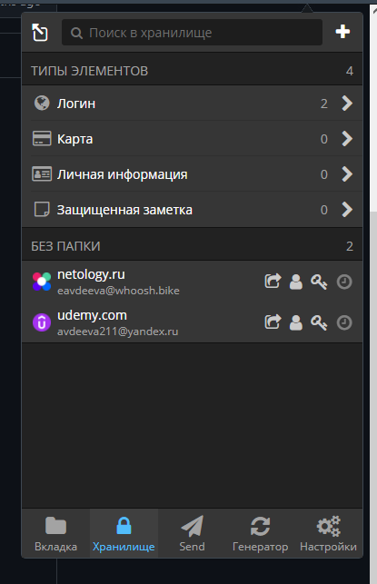
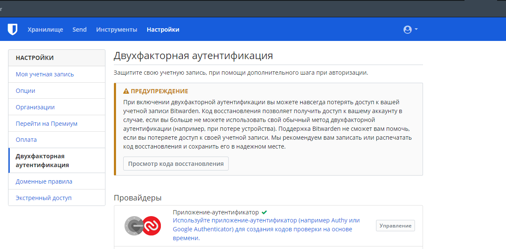
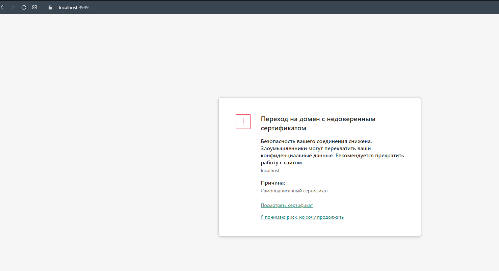
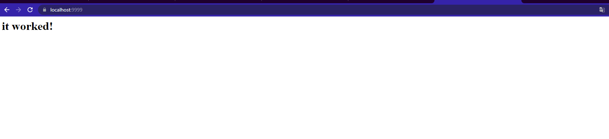
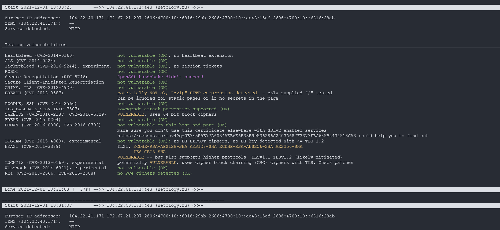
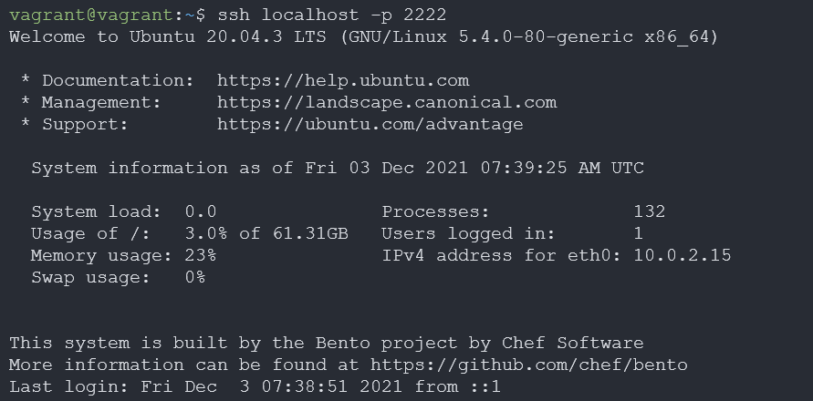
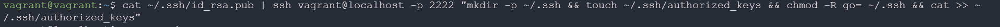
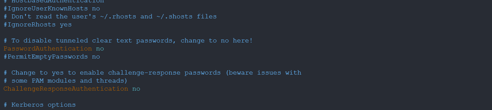
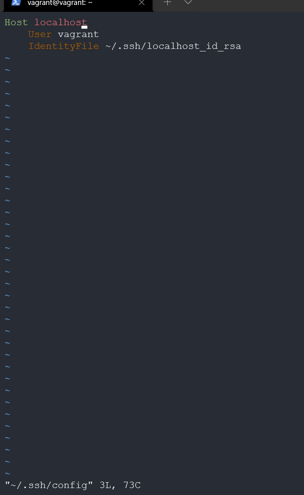
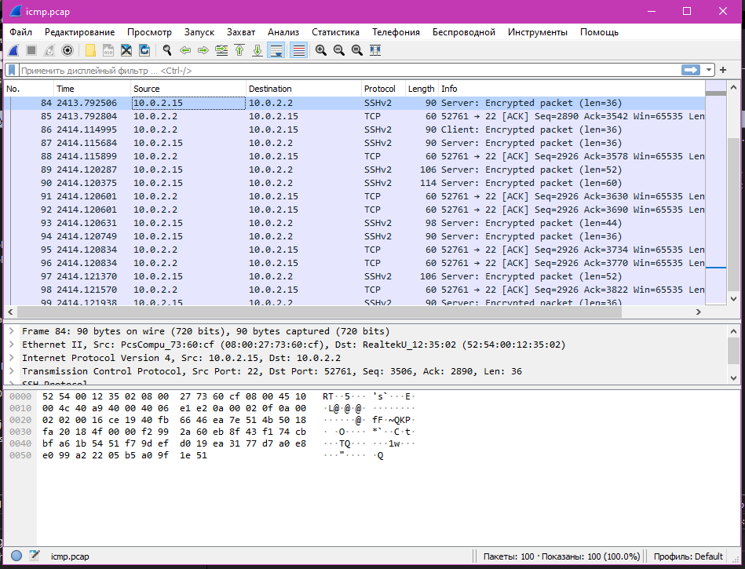

# Домашнее задание к занятию "3.9. Элементы безопасности информационных систем"

1. Установите Bitwarden плагин для браузера. Зарегистрируйтесь и сохраните несколько паролей.

2. Установите Google authenticator на мобильный телефон. Настройте вход в Bitwarden акаунт через Google authenticator OTP.

3. Установите apache2, сгенерируйте самоподписанный сертификат, настройте тестовый сайт для работы по HTTPS.
## я уже разобралась =)



4. Проверьте на TLS уязвимости произвольный сайт в интернете.

5. Установите на Ubuntu ssh сервер, сгенерируйте новый приватный ключ. Скопируйте свой публичный ключ на другой сервер. Подключитесь к серверу по SSH-ключу.



6. Переименуйте файлы ключей из задания 5. Настройте файл конфигурации SSH клиента, так чтобы вход на удаленный сервер осуществлялся по имени сервера.

7. Соберите дамп трафика утилитой tcpdump в формате pcap, 100 пакетов. Откройте файл pcap в Wireshark.
```
vagrant@vagrant:~$ sudo tcpdump -i eth0 -c 100 -w icmp.pcap
tcpdump: listening on eth0, link-type EN10MB (Ethernet), capture size 262144 bytes
100 packets captured
100 packets received by filter
0 packets dropped by kernel
```

___
## Задание для самостоятельной отработки (необязательно к выполнению)
8*. Просканируйте хост scanme.nmap.org. Какие сервисы запущены?
```
vagrant@vagrant:~$ nmap scanme.nmap.org
Starting Nmap 7.80 ( https://nmap.org ) at 2021-12-08 19:21 UTC
Nmap scan report for scanme.nmap.org (45.33.32.156)
Host is up (0.22s latency).
Other addresses for scanme.nmap.org (not scanned): 2600:3c01::f03c:91ff:fe18:bb2f
Not shown: 996 filtered ports
PORT      STATE SERVICE
22/tcp    open  ssh
80/tcp    open  http
9929/tcp  open  nping-echo
31337/tcp open  Elite
```
9*. Установите и настройте фаервол ufw на web-сервер из задания 3. Откройте доступ снаружи только к портам 22,80,443
 ```
 vagrant@vagrant:~$ sudo ufw status verbose
Status: active
Logging: on (low)
Default: deny (incoming), allow (outgoing), disabled (routed)
New profiles: skip

To                         Action      From
--                         ------      ----
22                         ALLOW IN    Anywhere
80                         ALLOW IN    Anywhere
443                        ALLOW IN    Anywhere
22 (v6)                    ALLOW IN    Anywhere (v6)
80 (v6)                    ALLOW IN    Anywhere (v6)
443 (v6)                   ALLOW IN    Anywhere (v6)
```
---

## Как сдавать задания

Обязательными к выполнению являются задачи без указания звездочки. Их выполнение необходимо для получения зачета и диплома о профессиональной переподготовке.

Задачи со звездочкой (*) являются дополнительными задачами и/или задачами повышенной сложности. Они не являются обязательными к выполнению, но помогут вам глубже понять тему.

Домашнее задание выполните в файле readme.md в github репозитории. В личном кабинете отправьте на проверку ссылку на .md-файл в вашем репозитории.

Также вы можете выполнить задание в [Google Docs](https://docs.google.com/document/u/0/?tgif=d) и отправить в личном кабинете на проверку ссылку на ваш документ.
Название файла Google Docs должно содержать номер лекции и фамилию студента. Пример названия: "1.1. Введение в DevOps — Сусанна Алиева".

Если необходимо прикрепить дополнительные ссылки, просто добавьте их в свой Google Docs.

Перед тем как выслать ссылку, убедитесь, что ее содержимое не является приватным (открыто на комментирование всем, у кого есть ссылка), иначе преподаватель не сможет проверить работу. Чтобы это проверить, откройте ссылку в браузере в режиме инкогнито.

[Как предоставить доступ к файлам и папкам на Google Диске](https://support.google.com/docs/answer/2494822?hl=ru&co=GENIE.Platform%3DDesktop)

[Как запустить chrome в режиме инкогнито ](https://support.google.com/chrome/answer/95464?co=GENIE.Platform%3DDesktop&hl=ru)

[Как запустить  Safari в режиме инкогнито ](https://support.apple.com/ru-ru/guide/safari/ibrw1069/mac)

Любые вопросы по решению задач задавайте в чате Slack.

---
